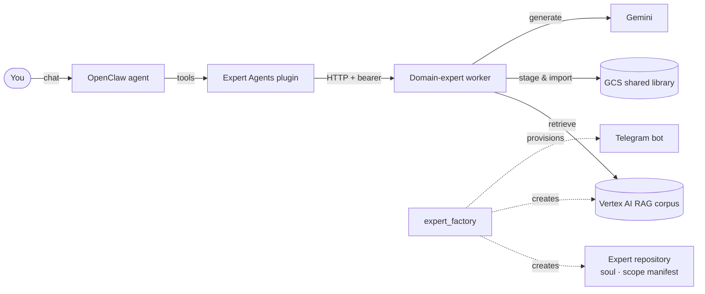

<p align="center">
  
</p>

<h1 align="center">Expert Agents</h1>

<p align="center">
  <strong>Build AI experts that answer from a library you choose — and cite every claim.</strong>
</p>

<p align="center">
  <a href="https://github.com/jamiezigelbaum/expert-agents/actions/workflows/verify.yml"></a>
  <a href="LICENSE"></a>
  
  
  
</p>

<p align="center">
  <a href="#quickstart">Quickstart</a> ·
  <a href="#how-it-works">How it works</a> ·
  <a href="#create-an-expert">Create an expert</a> ·
  <a href="#tools">Tools</a> ·
  <a href="docs/README.md">Docs</a>
</p>

---

Expert Agents turns an [OpenClaw](https://docs.openclaw.ai) assistant into a
team of specialists. Each expert has its own curated library — books, papers,
transcripts, web pages — indexed in a Google Vertex AI RAG corpus. When you ask
it something, it retrieves from that library, answers with numbered citations
back to the exact source, and says plainly when the library doesn't cover the
question.

You can create a new expert by asking for one in chat. The factory gives it its
own Git repository, its own library and corpus, and its own Telegram bot, then
walks you through confirming each step.

## Why

General-purpose assistants blend everything they've read, and you can't tell
where an answer came from. Expert Agents gives you the opposite trade:

- **Bounded** — an expert answers only from the sources you approved, so you
  know what it knows.
- **Cited** — every answer points back to title, author and passage, so you can
  check it.
- **Honest about gaps** — when retrieval comes back thin, the expert says so
  instead of filling in from memory.
- **Yours** — each expert's persona, workspace and holdings live in its own
  repository; this repository is only the machinery they share.

## Features

- **Grounded answers** — multi-query retrieval over Vertex AI RAG with
  reranking, fusion, and passage-level citations that carry title and creator.
- **Conversational factory** — `expert_factory` creates an expert end to end:
  repository and soul, library route, Vertex corpus, and a managed Telegram bot.
  Progress is saved, so creation resumes cleanly after each confirmation.
- **Library intake** — ingest PDFs (up to 100 MB, split with page provenance),
  EPUB and other ebooks, web pages, YouTube transcripts, and reviewed text into a
  content-addressed shared library with per-expert scope manifests.
- **Approval-gated acquisition** — search book catalogs for candidates, then
  download and import only what the owner approves.
- **Document collaboration** — read, comment on, and apply approved edits to
  configured documents.
- **Safe by construction** — credentials enter only through a task-scoped
  adapter and never appear in output, logs or receipts; network fetches are
  DNS-pinned and allowlisted; every write is planned before it is applied.
- **One engine, many consumers** — marketplaces and expert providers call the
  same worker, so a retrieval improvement lands everywhere at once.

## How it works



| Piece | Where | What it does |
| --- | --- | --- |
| **Plugin** | `src/` | Registers the tools with OpenClaw and forwards calls to the worker. |
| **Worker** | `packages/runtime` | Plans, retrieves, cites, ingests and acquires. Runs as a systemd service or container. |
| **Library** | `packages/library`, `packages/library-materializer` | Content-addressed objects in GCS, per-expert scope manifests, append-only import into Vertex. |
| **Factory** | `packages/provisioning` | Creates and resumes experts: repository, corpus, bot and binding. |
| **Skills** | `skills/` | Tenant-neutral operating instructions the agent follows when using the tools. |

## Quickstart

**Requirements:** [Bun](https://bun.sh) 1.3+ to build. To run an expert you also
need an OpenClaw installation and a Google Cloud project with Vertex AI RAG
enabled and a GCS bucket for the shared library.

```sh
git clone https://github.com/jamiezigelbaum/expert-agents.git
cd expert-agents
bun install --frozen-lockfile
bun run verify
```

`verify` runs the full gate: boundary scan, TypeScript, every test, all builds,
plugin and deploy packaging, and a scan of the shipped artifacts. It never skips
a missing prerequisite, so green means green.

A successful build leaves two installable artifacts:

| Artifact | Install |
| --- | --- |
| `dist/plugin-package/` | The OpenClaw plugin. Install it with OpenClaw's plugin installer and restart the gateway in the same step, so the plugin registers after its secret references resolve. |
| `dist/deploy-package/` | The worker release. Follow the [deployment guide](deploy/README.md) for systemd or the container image. |

### Configure

Point the plugin at your worker. The bearer can be a literal or an OpenClaw
SecretRef; prefer the SecretRef.

```json
{
  "domainExpert": {
    "enabled": true,
    "baseUrl": "http://127.0.0.1:8040",
    "authToken": { "source": "env", "provider": "default", "id": "EXPERT_AGENTS_DOMAIN_EXPERT_AUTH_TOKEN" }
  }
}
```

The worker reads its routing — which domains exist, their library prefix and
target corpus — from `EXPERT_AGENTS_DOMAIN_EXPERT_AGENTS_JSON`:

```json
{
  "history": {
    "displayName": "History Expert",
    "library": { "bucket": "<shared-library-bucket>", "prefix": "<shared-library-prefix>" },
    "targetCorpusDisplayName": "history-library"
  }
}
```

Every environment field is listed in
[`deploy/systemd/domain-expert.env.example`](deploy/systemd/domain-expert.env.example).

## Create an expert

With the factory enabled (see [the factory guide](docs/FACTORY.md) for its
one-time setup), ask your OpenClaw agent:

> Create a climate-science expert that answers from the IPCC reports and the
> papers I give it. Call it Climate Expert.

The agent calls `expert_factory`, which:

1. Creates the expert's own Git repository with a purpose-based soul (or runs
   the guided `soul-workshop` if you want to shape its identity).
2. Registers its library route and creates its Vertex corpus.
3. Returns Telegram's confirmation link for a new managed bot — you tap once.
4. Binds the bot to the new agent and checks readiness.

A new corpus starts empty. Add sources in chat through the `domain-research`
skill, or from a shell:

```sh
bun run expert:library -- ingest --scope <agent-repo>/library/scope-manifest.json \
  --library ./candidates --bucket "$LIBRARY_BUCKET" --prefix "$LIBRARY_PREFIX" \
  --receipts ./receipts https://example.com/paper.pdf
```

Then ask it something:

```sh
bun run expert:library -- ask --domain climate "What drives sea-level rise?" --passages
```

## Tools

| Tool | What it does |
| --- | --- |
| `domain_ask` | Answer a question from the expert's corpus with citations and explicit gaps. |
| `domain_agent` | Plan or inspect a domain expert's configuration. |
| `domain_source` | Register and manage sources in an expert's source registry. |
| `rag_corpus` | Plan or perform bounded corpus operations: status, staging and import. |
| `domain_doc` | Read, comment on, or apply an approved edit to a configured document. |
| `annas_archive_search` | Search book catalogs for candidates without downloading. |
| `annas_archive_import` | Download and import an explicitly approved item. |
| `expert_factory` | Create, resume, or check on a new expert. Owner-only and disabled by default. |

And the skills that teach an agent to use them well: `domain-research`,
`expert-agent-workshop`, `expert-annas-archive-acquisition`, and
`soul-workshop`.

## Operator CLI

Everything the agent can do, an operator can do from a shell with
`bun run expert:library -- <command>`:

| Command | Purpose |
| --- | --- |
| `health` | Check the worker is up and authenticated. |
| `ask` | Ask an expert a question, optionally returning raw passages. |
| `search` | Find candidate books for a domain. |
| `acquire` | Download and import an approved book, waiting out busy corpora. |
| `source register` | Record a source with its title, author and locator. |
| `status` | Show a domain's corpus status. |
| `ingest` | Stage local files or URLs into the library and import them, using Google credentials directly. |

The worker token is read only from `EXPERT_AGENTS_WORKER_TOKEN` or a token file —
never from an argument, and never printed. See the
[CLI reference](docs/LIBRARY_ARCHITECTURE.md#operator-cli).

## Project layout

```
.
├── src/                          OpenClaw plugin entry and tool schemas
├── packages/
│   ├── runtime/                  domain-expert worker (HTTP server)
│   ├── library/                  library model, ingestion, retrieval preferences
│   ├── library-materializer/     plan/execute import into Vertex corpora
│   └── provisioning/             expert factory and agent-repository scaffolding
├── skills/                       OpenClaw operating skills
├── scripts/                      operator CLIs, packaging and verification gates
├── deploy/                       systemd unit, container image, env examples
├── docs/                         architecture and operating guides
└── test/                         repository-level tests
```

## Documentation

| Guide | Covers |
| --- | --- |
| [Factory](docs/FACTORY.md) | Setting up and running conversational expert creation. |
| [Library architecture](docs/LIBRARY_ARCHITECTURE.md) | Object identity, manifests, materialization, and the operator CLI. |
| [Agent repository contract](docs/AGENT_REPO_CONTRACT.md) | What each expert's own repository contains, and deployment postures. |
| [Deployment guide](deploy/README.md) | Installing, configuring, upgrading and rolling back the worker. |
| [Retrieval evaluation](docs/RETRIEVAL_EVAL.md) | Measuring answer quality against a question set. |
| [Architecture](ARCHITECTURE.md) | The boundaries every change keeps. |

The full index is in [docs/](docs/README.md), and open work is in [PLAN.md](PLAN.md).

## Contributing

Contributions are welcome. Read [CONTRIBUTING.md](CONTRIBUTING.md) first — the
short version is: keep the runtime tenant-neutral, keep secrets out of output,
and make `bun run verify` pass. Please report security issues privately as
described in [SECURITY.md](SECURITY.md), not in a public issue.

## License

[MIT](LICENSE)
